# Momentum

A mobile app made used for tracking personal projects.
The core philosophy is that projects are never "done", so the app tracks 
momentum and time invested, not completion.

Also, the data is always locally stored (sqlite DB). No login required, and no 
information is collected. You can use it without the internet. Made using 
Flutter.

## The Problem

Personal learning projects do not stall because of lost interest, but because 
there's no lightweight way to notice neglect, record progress, or capture 
ideas as they come. Traditional task managers impose a completion mindset 
that doesn't fit open-ended technical work.

Momentum seeks to fill that gap by being an open-ended project tracker.
It keeps track of sessions, the last time you touched the project, and stores
your ideas as they come.

## Features

### Projects
Add you projects to track them. Projects can be active, or planned, or archived.
The philosophy behind these three states is:

<div align="center">
  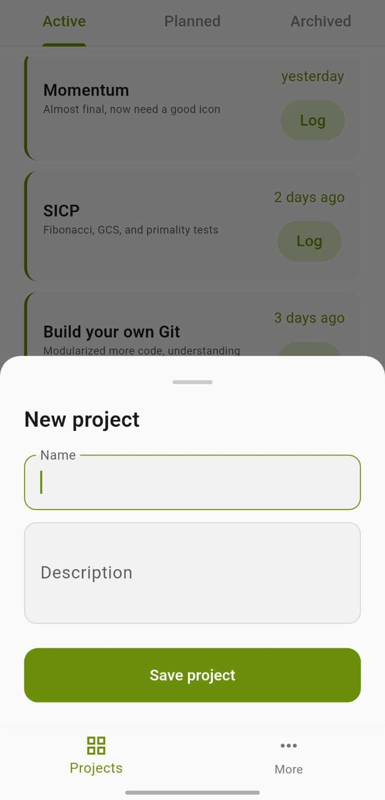
  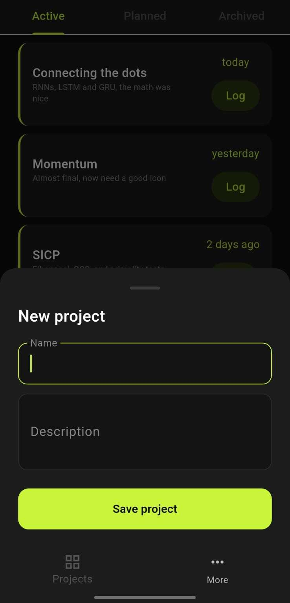
  <br />
  <sub>Add a new project</sub>
</div>
<br />

1. If there is a project which you have in mind but you haven't actively started
working on it, it goes into the planned state. This is the default state of all
projects that get created.

<div align="center">
  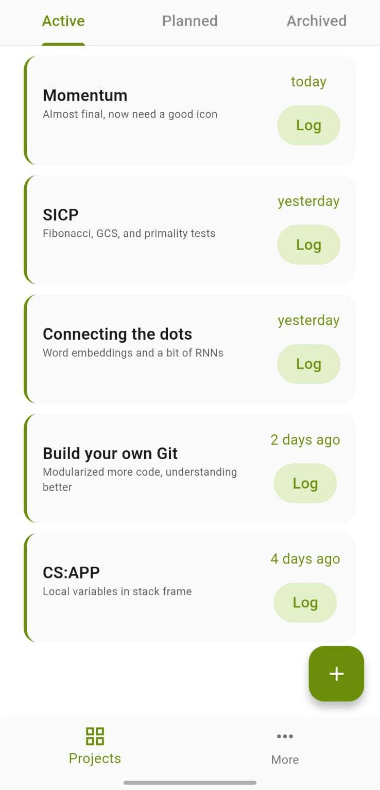
  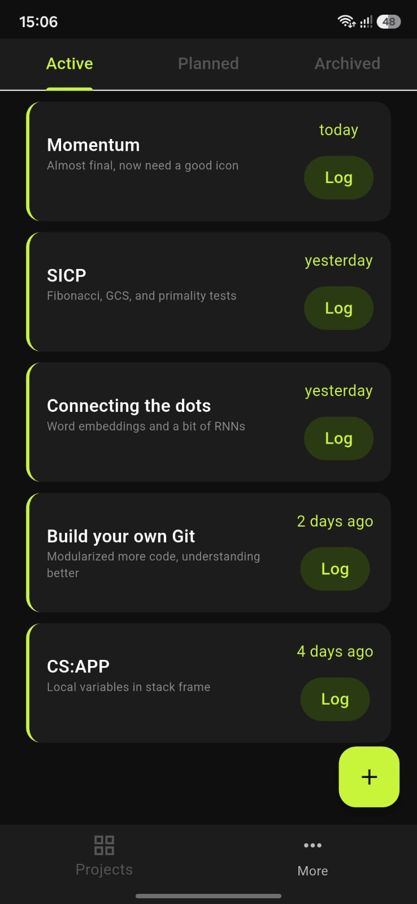
  <br />
  <sub>Active projects list</sub>
</div>
<br />

2. If there is a project that you are actively working on right now, and want
to keep track of your activity and investment in it, then it goes into the active
state.

<div align="center">
  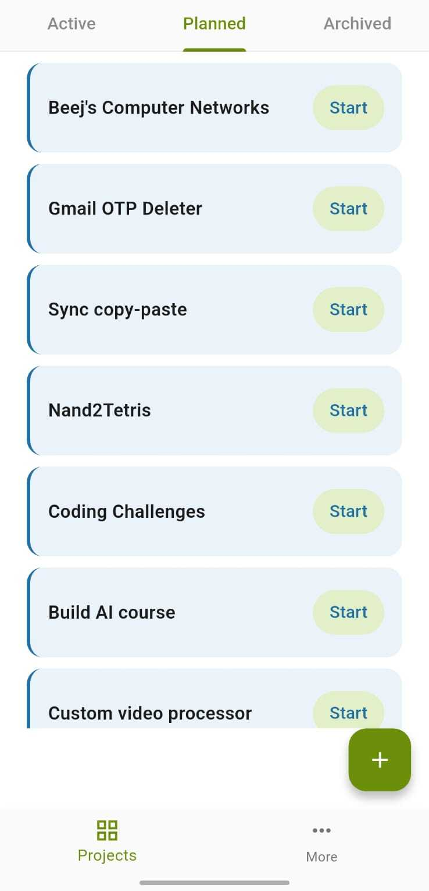
  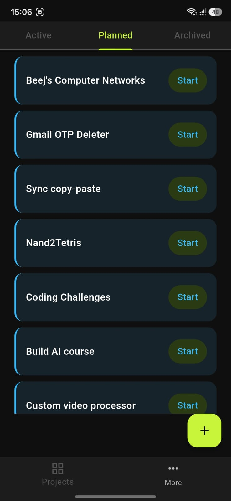
  <br />
  <sub>Planned projects list</sub>
</div>
<br />

3. If there is a project that you feel like putting on the back burner for now,
then archive it. You can always unarchive it any time.

<div align="center">
  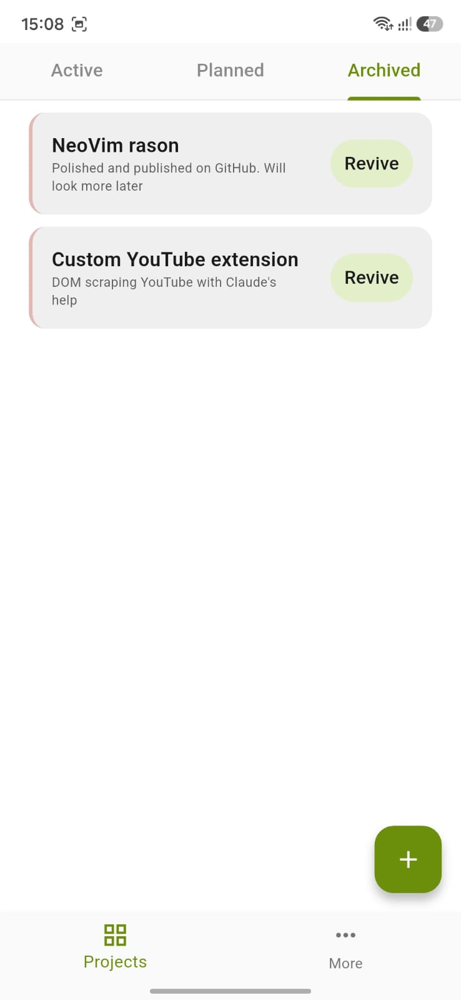
  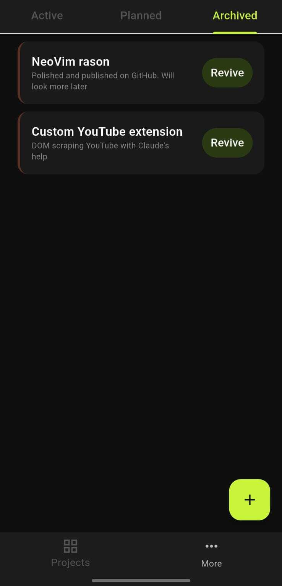

  <br />
  <sub>Archived projects list</sub>
</div>
<br />

### Sessions

You can log sessions to keep a log of what you have been working on in a project.
A session is specific to a project. Active projects will show how many days it
has been since you last logged a session. The log list is maintained, so you
can always get a record of what all you have worked on on which day.

<div align="center">
  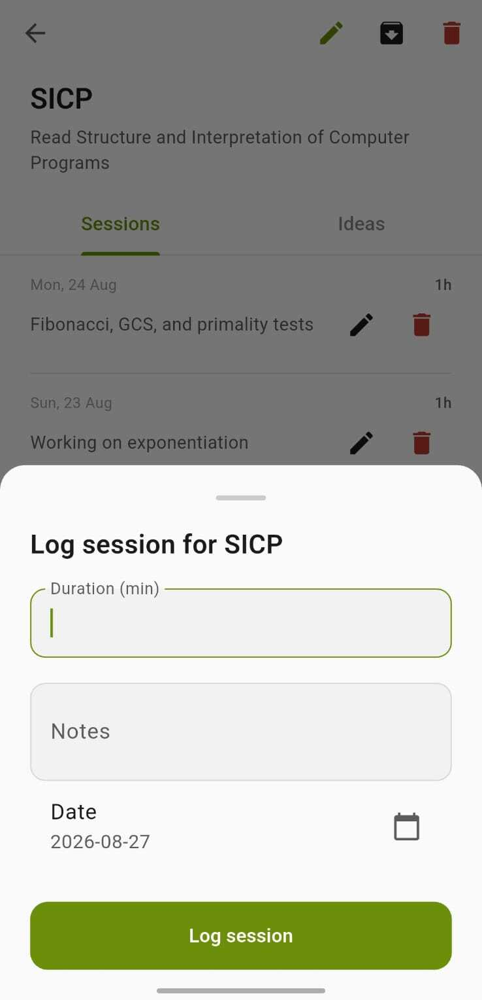
  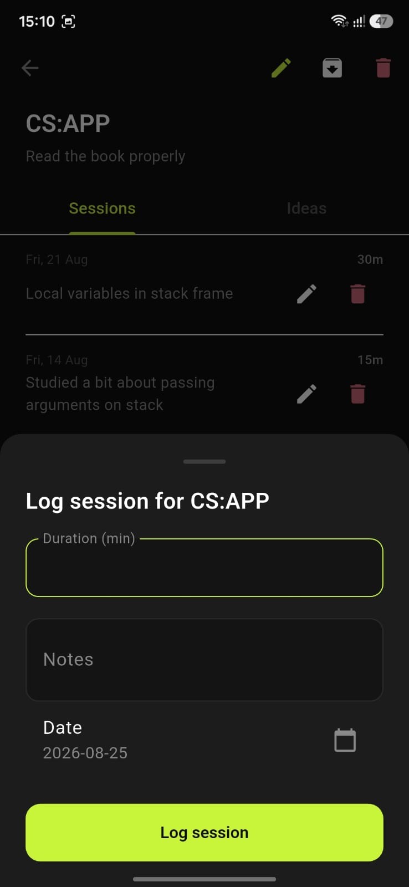

  <br />
  <sub>Log session</sub>
</div>
<br />

<div align="center">
  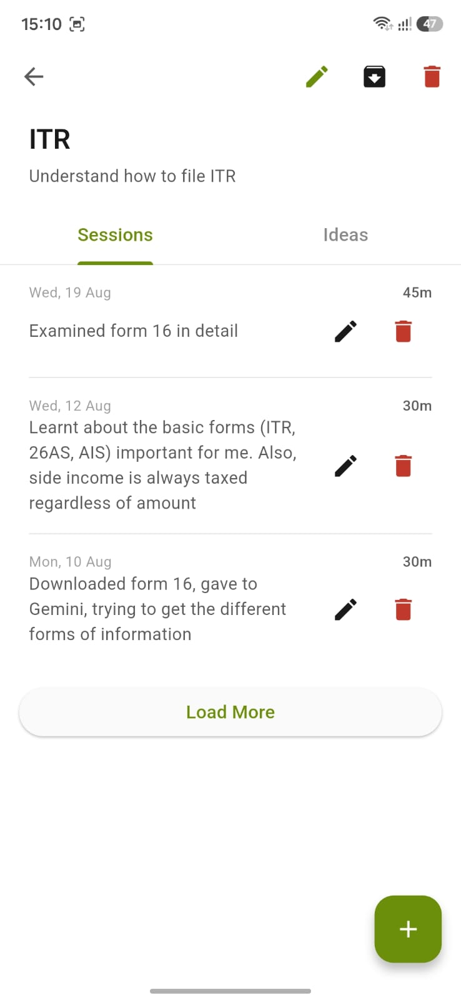
  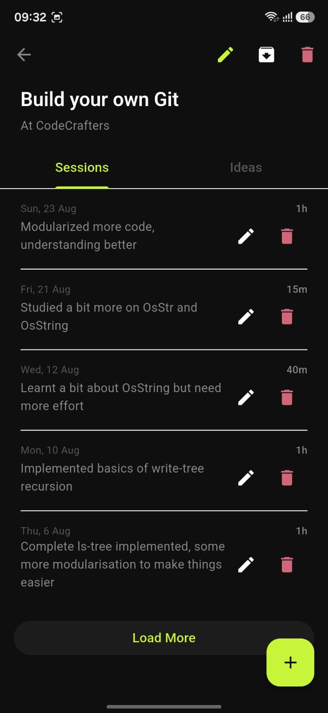
  <br />
  <sub>Project with sessions</sub>
</div>
<br />

### Ideas

Your project may have some major milestones that you want to keep track of.
The Ideas section of a project does just that.

<div align="center">
    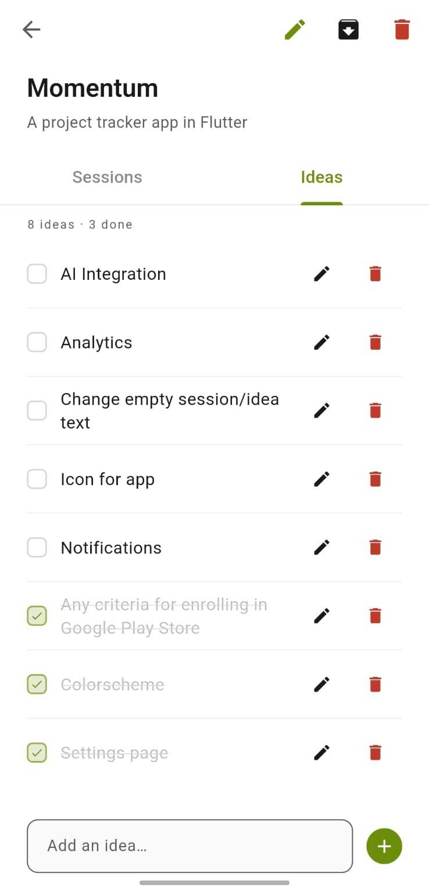
    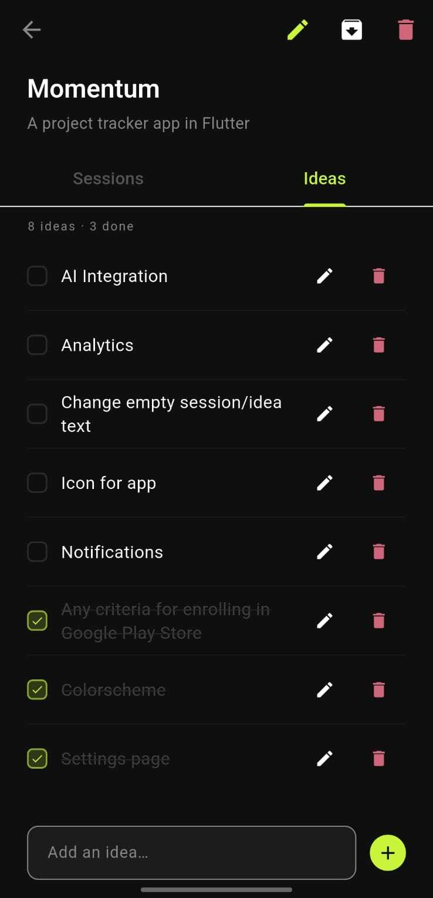
    <br />
    <sub>Project ideas</sub>
</div>
<br />

## Build from source
Make sure that your Flutter version is at least `3.44.8`.

Clone the repo:
```bash
git clone https://github.com/adarsh-kishore786/momentum
cd momentum
```

Install dependencies:
```bash
flutter pub get
```

For Android, you can build an APK and install that:
```bash
flutter build apk --release
```
Alternatively, you can execute run from command line directly and install on your phone:
```bash
flutter run --release
```

For iOS, you can build from source if you have MacOS and Xcode installed.
