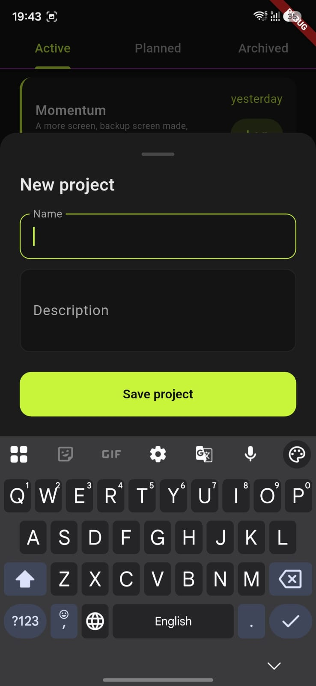
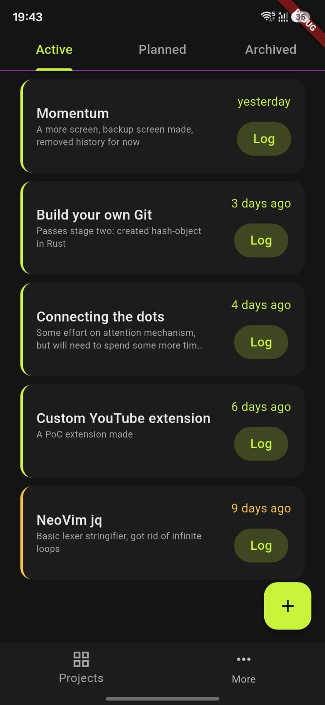
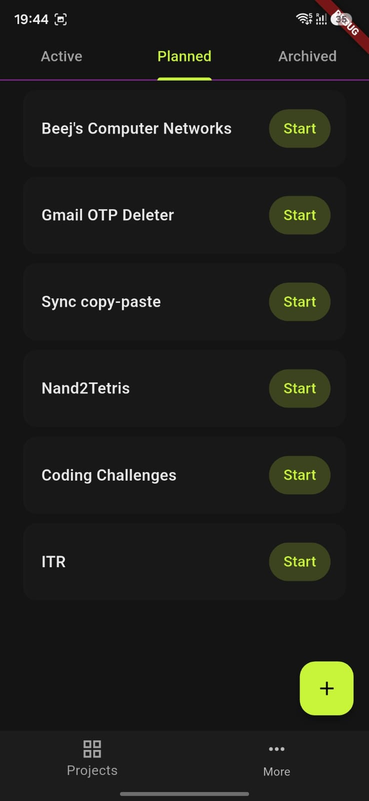
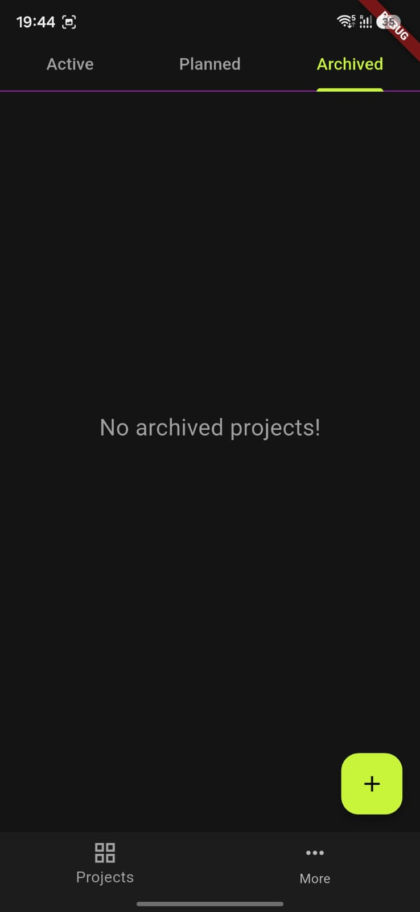
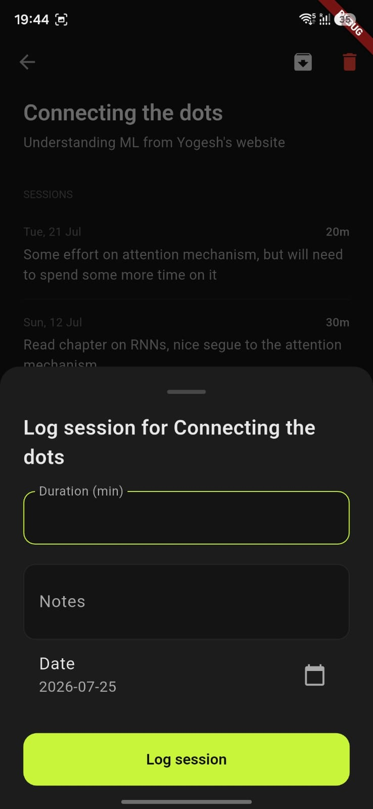
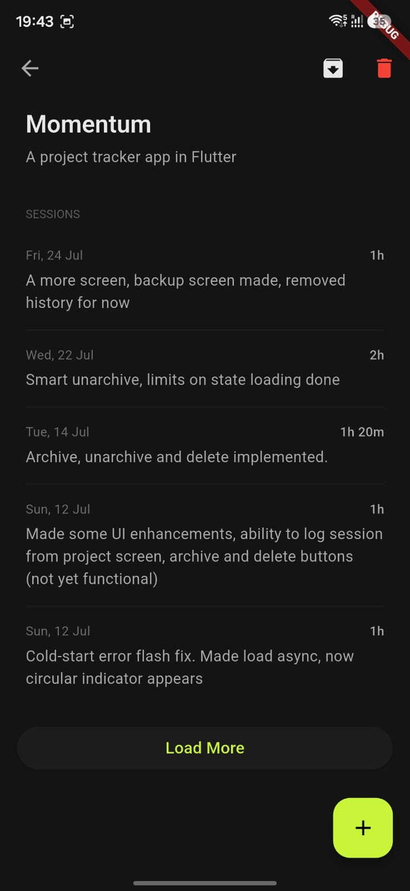

# Momentum

A mobile app (Flutter) for tracking personal technical projects.
The core philosophy: projects are never "done", so the app tracks 
momentum and time invested, not completion.

## The Problem

Personal learning projects stall not because of lost interest, but because 
there's no lightweight way to notice neglect, record progress, or capture 
ideas as they come. Traditional task managers impose a completion mindset 
that doesn't fit open-ended technical work.

## Features

### Projects
Add you projects to track them. Projects can be active, or planned, or archived.
The philosophy behind these three states is:

  
   
  Add a new project

 

1. If there is a project which you have in mind but you haven't actively started
working on it, it goes into the planned state. This is the default state of all
projects that get created.

  
   
  Active projects list

 

2. If there is a project that you are actively working on right now, and want
to keep track of your activity and investment in it, then it goes into the active
state.

  
   
  Planned projects list

 

3. If there is a project that you feel like putting on the back burner for now,
then archive it. You can always unarchive it any time.

  
   
  Archived projects list

 

### Sessions

You can log sessions to keep a log of what you have been working on in a project.
A session is specific to a project. Active projects will show how many days it
has been since you last logged a session. The log list is maintained, so you
can always get a record of what all you have worked on on which day.

  
   
  Log session

 

  
   
  Project with sessions

 
